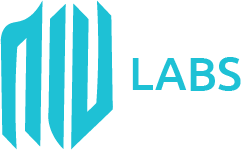
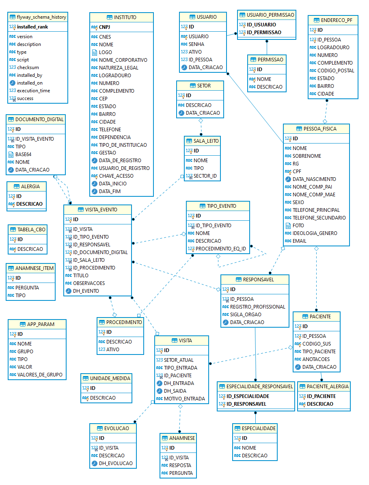

<h1 align="center">
  
</h1>
<h2 align="center">
  NiV Labs - Gestão de Prontuário - API
</h2>

O NLGP-API é uma API Rest criada inicialmente como doação para hospitais que não possuem nenhuma solução de automação no processo de prontuário. O NLGP-API é integrado com um client baseado em Angular, o [NLGP-UI](https://github.com/niv-labs/gestao-de-prontuario-ui).

    
    

Atualmente encontra-se na versão 1.0.0
[Swagger](https://gestao-prontuario.herokuapp.com/swagger-ui.html)

---

## Índice

<ul>
  <li><a href="#funcionalidades-da-api">Funcionalidades da API</a></li>
  <li><a href="#mínimo-para-rodar">Mínimo para rodar</a></li>
  <li><a href="#projeto-lombok">Projeto Lombok</a></li>
  <li><a href="#mysql-ou-mariadb">Configurando banco de dados</a></li>
  <li><a href="#como-rodar-a-api">Como rodar a API?</a></li>
  <li><a href="#como-contribuir">Como contribuir?</a></li>
  <li><a href="#contato">Contato</a></li>
  <li><a href="#-license">License</a></li>
</ul>

---

## Funcionalidades da API

- [x] Cadastro de Pacientes
- [x] Cadastro de Responsáveis (Enfermeiro, Médico, Técnico, etc)
- [x] Cadastro de Eventos (Consultas, exames, prescriçoes, etc)
- [x] Cadastro de Usuários
- [x] Controle de Acesso
- [x] Armazenamento de documentos (Resultado de exames, radiografia, tumografia, etc)
- [x] Histórico de visita em forma de timeline
- [x] Relatórios
- [x] Paciente não identificado
- [x] Fluxo padrão para atendimento ambulatorial
- [x] Fluxo padrão para atendimento emergencial
- [x] Cadastro de medicamentos e materiais

---

## Mínimo para rodar

Para rodar o projeto, existem alguns requisítos mínimos de configurações, são eles:

- Java 15 + **(Obrigatório)**
- MariaDB Server 10.3+ **(Obrigatório se não for rodar via docker)**
- Lombok 1.18.0 + **(Obrigatório)**
- Eclipse ou STS **(Obrigatório)**
- Docker **(Obrigatório se for rodar via script)

---

## Projeto Lombok

### O que é o Lombok?
O [Lombok](https://projectlombok.org/) é uma biblioteca Java focada em produtividade e redução de código boilerplate que por meio de anotações adicionadas ao nosso código ensinamos o compilador (maven ou gradle) durante o processo de compilação a criar código Java.

### Por qual motivo devo configurar minha IDE para usar o Lombok?
Este projeto foi desenvolvido utilizando o Lombok para criação de POJOs e DTOs, por este motivos, faz-se necessário configurar a sua IDE.

### Como configurar?
Obs: Este processo só é válido para IDEs baseadas em [Eclipse Project](https://www.eclipse.org/) (Eclipse IDE e STS).

##### Passo 1

- Navegar via terminal para o repositório do Lombok
- Windows -> cd `C:\users\{usuario}\.m2\repository\org\projectlombok\lombok\{versao_baixada}`
- Linux e Mac -> cd `~/.m2/repository/org/projectlombok/lombok/{versao_baixada}`

##### Passo 2

- Executar o jar do lombok utilizando o comando `java -jar lombok.{versao}.jar`

##### Passo 3

- Selecionar o Eclipse/STS que irá receber o Lombok

##### Passo 4

- Clicar em Install/Update

##### Passo 5

- Sair do instalador

##### Passo 6

- Reiniciar a IDE

##### Passo 7

- Realizar um Maven Update no projeto

##### Mais informações

Existe um manual mais detalhado de como instalar o plugin no Eclipse: [Criando uma API Rest de cadastro de contatos em 5 minutos com Spring Boot + Lombok](https://medium.com/@niv-labs/criando-uma-api-rest-de-cadastro-de-contatos-em-5-minutos-com-spring-boot-ce5ba775d2d8)

---

## MariaDB
### Sem Docker

Para que seja possível rodar a aplicação, faz-se necessário configurar previamente as informações de conexão no arquivo `application-dev.properties` deste projeto.

Um setup inicial válido para uma base nova pode seguir os padrões abaixo:

- URL de conexão da base `spring.datasource.url=jdbc:mariadb://[SERVIDOR]:[PORTA]/[BASE]?user=[NOME_USUARIO]&password=[SENHA]&createDatabaseIfNotExist=TRUE`, o `createDatabaseIfNotExist=TRUE` faz com que o próprio framework crie a base de dados.

- No meu caso, a primeira linha do meu `application-dev.properties` fica `spring.datasource.url=jdbc:mariadb://localhost:3306/devdb?user=admin&password=123456dv&createDatabaseIfNotExist=TRUE`

### Com Docker
O projeto possui um build pronto do MariaDB em Docker, neste caso não precisamos alterar nada, basta executar o shellscript `./run-mariadb.sh` e seguir para o próximo passo.

OBS: Obrigatório ter o Docker instalado.

---

## Como rodar a API?

### Usando Docker
#### Passo 1
- 👯 Clone este repositório na sua máquina local usando `https://github.com/niv-labs/gestao-de-prontuario.git`

#### Passo 1
- 🔃 Rode o script `./startWithDocker.sh`

OBS: Obrigatório ter o Docker instalado.

### Usando o Eclipse ou STS
#### Passo 1

- 👯 Clone este repositório na sua máquina local usando `https://github.com/niv-labs/gestao-de-prontuario.git`

#### Passo 2

- ✅ Importe o projeto na sua IDE

#### Passo 3

- 📝 Altere a primeira linha do `application.properties`para `spring.profiles.active=dev`

#### Passo 4

- 🔃 Rode a aplicação com botão direito do mouse no projeto, `run as` > `Spring Boot App`. Também é possível rodar a aplicação à partir da classe `ApplicationMain` dentro do projeto, basca clicar com o botão direito na classe e seguir o mesmo fluxo.

#### Dica
Se você estiver usando o Eclipse, pode ser uma boa ideia baixar o plugin disponibilizado pela Pitoval no marketplace, o `Spring Tools 4 (release)`

---

## Como contribuir

### Passo 1

- 🍴 Realize um Fork deste respositório!

### Passo 2

- 👯 Clone este repositório na sua máquina local usando `https://github.com/niv-labs/gestao-de-prontuario.git`

### Passo 3

- 🎋 Crie sua branch de funcionalidade usando `git checkout -b minha-funcionalidade`

### Passo 4

- ✅ Realize o commit de suas alterações usando `git commit -m 'feat: Minha nova funcionalidade'`;

### Passo 5

- 📌 Realize o push para a branch usando `git push origin minha-funcionalidade`;

### Passo 6

- 🔃 Crie um novo pull request

Depois que seu Pull Request é aceito e o merge é realizado, você pode deletar a sua branch de funcionalidade.

---

## Arquitetura (Em desenvolvimento...)
Esta área especifica definições técnicas da aplicação, suas características e comportamentos.
### Modelagem de dados

---

## Contato

> Você pode me encontrar por aqui...

- NiV Labs :: [NiV Labs](http://www.nivlabs.com.br)
- Atendimento :: [atendimento@nivlabs.com.br](atendimento@nivlabs.com.br)

---

## 📝 License

Este projeto é licenciado por MIT License - Veja a licença no arquivo [LICENSE](LICENSE) para mais detalhes.

---

